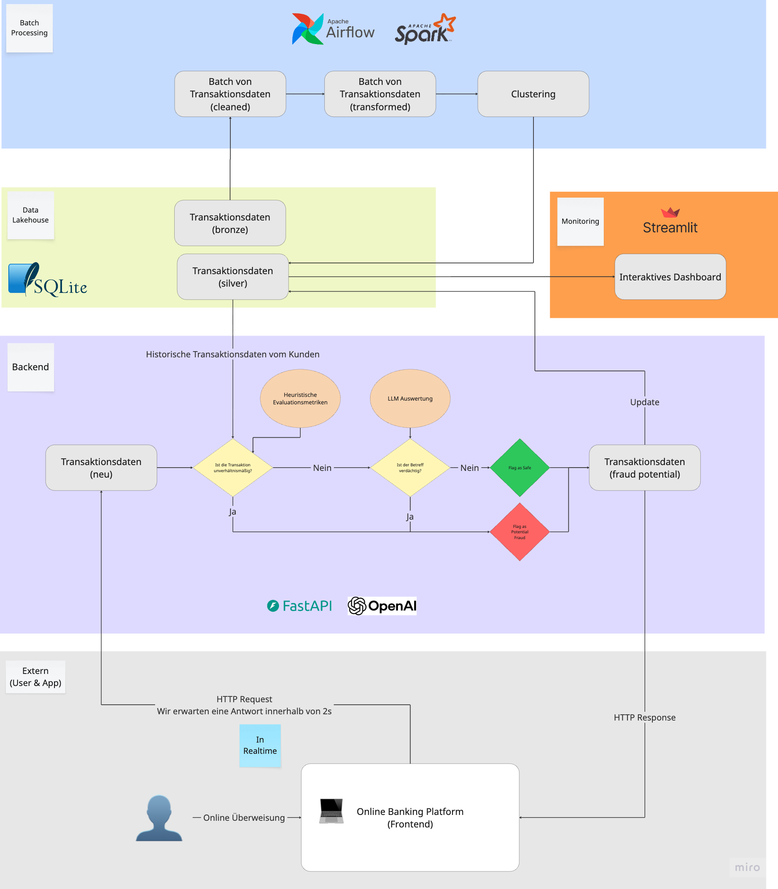

# Day 3 – End-to-end Fraud Analytics (Data Engineering Focus)

This folder contains a small, realistic data engineering stack around banking fraud analytics:

- Ingestion and transformation (Airflow + PySpark) – clean CSVs, engineer features, cluster customers, and label transactions
- Serving API (FastAPI + SQLModel) – accept transactions, whitelist with history, optionally call an LLM, and persist to SQLite
- Monitoring (Streamlit) – live dashboard showing metrics, recent transactions, and cluster summary tables

All storage is local SQLite for portability:

- `data/transactions.db` – main OLTP-like store for transactions
- `data/transactions_clusters.db` – small OLAP-like table for cluster counts

## Architecture at a glance

1. Batch: Airflow orchestrates PySpark tasks

- Clean: read raw CSV, minimal casting, write to `transactions`
- Cluster: build per-customer features; KMeans with scaling; write cluster distribution to `transactions_clusters`
- Join/Label: load JSON labels; update `transactions.is_fraud` by id

2. Serve: FastAPI accepts POST /transaction

- Validates schema (Pydantic/SQLModel)
- Heuristic whitelist against historical behavior
- Optional LLM-based text scoring (if API key configured)
- Persists to `transactions.db`

3. Observe: Streamlit dashboard

- Top-level KPIs (counts, sums, flagged vs. labeled fraud)
- Recent transactions table with filters (flagged_fraud, is_fraud)
- Clusters table from `transactions_clusters.db`

---

## Quickstarts

Prereqs

- Python 3.12+
- Create and activate a venv, then install requirements

### 1) API – FastAPI app

- Location: `labs/day3/app`
- What it does: Accepts transactions, applies whitelist + simple evaluator, stores to SQLite
- Start the API:
  - In the `labs/day3/app` folder, run the app (uvicorn dependency assumed via requirements):
    - uvicorn main:app --host 127.0.0.1 --port 8081 --reload
  - Endpoint: http://127.0.0.1:8081/transaction (POST)
- Expect: JSON response with suspicious flag, reason, score; new row in `data/transactions.db`

Example request (schema excerpt):

```
POST /transaction { id, date, client_id, card_id, amount, currency, ..., flagged_fraud, is_fraud }
```

### 2) Pipeline – Airflow + PySpark

- Location: `labs/day3/data-miner`
- What it does: clean → cluster → join/label into SQLite
- DAG: `transactions_ingest`
- Setup (one-time):
  - Use a dedicated venv (this folder has `.airflow-venv` example) and install `data-miner/requirements.txt`
  - Ensure TX_CSV_PATH points to your raw CSV (e.g., `labs/day3/data/transactions_data.csv`)
  - Ensure TX_SQLITE_DB points to `labs/day3/data/transactions.db`
- Run:
  - Start Airflow webserver/scheduler (or `airflow standalone`) with this repo as the dags_folder
  - Trigger `transactions_ingest`
- Expect:
  - `transactions.db` populated/updated
  - `transactions_clusters.db` holding cluster counts

### 3) Monitoring – Streamlit dashboard

- Location: `labs/day3/monitoring`
- What it does: Displays KPIs + 20-row recent table (filters for flagged_fraud/is_fraud) + all clusters table
- Start:
  - In the `monitoring` folder: **streamlit run app.py**
- Expect:
  - Metrics: total transactions, total amount, potential_fraud, is_fraud (labels)
  - Recent transactions: paged 20 entries, filters for flagged_fraud and is_fraud
  - Clusters table: all rows from `transactions_clusters.db`

---

## Notes and tips

- Paths: the code uses `os.path` and works relative to the app directories; ensure the `data/` folder exists
- SQLite locks: avoid running heavy writes and reads simultaneously if you see lock timeouts; Airflow tasks serialize writes
- LLM helper: requires `OPENAI_API_KEY` (optional); see `app/modules/whitelist/llm_whitelist.py`
- Reset DB: the API includes a reset endpoint to drop/recreate tables in development


